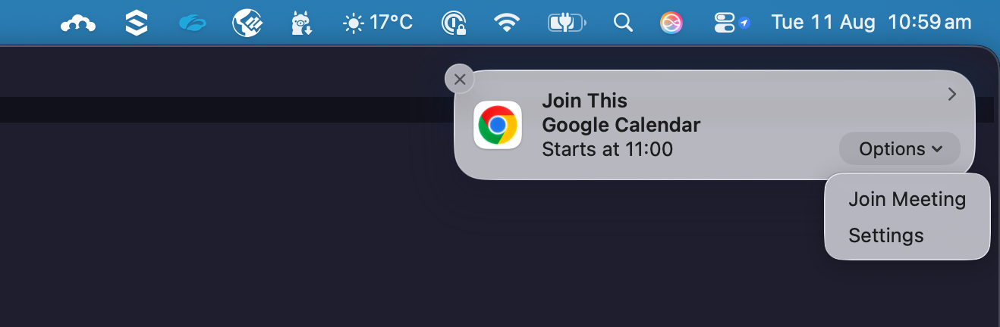

# Notify GCal

A Chrome extension that shows a native notification when a Google Calendar event is about to start. Useful if macOS/Chrome notifications for Calendar aren't showing up reliably on their own.

## What It Does

Twice a minute, a background service worker checks your primary Google Calendar for events starting soon (configurable lead time) and shows a Chrome notification with a sound for each one. If the event has a Google Meet link, the notification includes a "Join Meeting" button. Clicking the notification (or that button) opens the video call link, or the event's Calendar page if there isn't one.

On macOS, hover over the banner and click "Options" to reveal the "Join Meeting" button, since Mac hides notification action buttons by default.

## Project Contents

- `manifest.json`: extension config, permissions, and OAuth client settings
- `background.js`: service worker handling polling, notification logic, and message handling
- `popup.html` / `css/popup.css` / `js/popup.js`: the toolbar popup UI
- `offscreen.html` / `js/offscreen.js`: an offscreen document that plays the notification sound, since service workers can't play audio directly
- `icons/`: toolbar and notification icons (16/48/128px)
- `images/`: screenshots used in this README

## First-Time Developer Setup

Do this once, before anyone can use the extension. It's needed because `manifest.json` still has a placeholder `oauth2.client_id` (`YOUR_CLIENT_ID.apps.googleusercontent.com`) with no real Google Cloud OAuth client behind it yet.

`manifest.json` already includes a `key` field, which pins the extension's ID to `hpealioapkmpepakpmnjbelpcegdaihn` no matter which machine or folder path it's loaded from (Chrome normally derives the ID from the install path, which would otherwise give every user a different ID). That means one OAuth client registration below covers everyone who loads this same copy of the folder. Don't remove or regenerate the `key` field, or the ID will change and break sign-in for everyone already set up.

### 1. Create an OAuth client for the extension

- Go to the [Google Cloud Console](https://console.cloud.google.com/)
- Create a new project (or pick an existing one)
- Enable the "Google Calendar API" for that project (APIs & Services > Library)
- Configure the OAuth consent screen (APIs & Services > OAuth consent screen) if you haven't already
  - "Internal" if you have a Google Workspace account, so anyone in your org can sign in without being added individually
  - Otherwise "External", and add each teammate's Google account as a test user (up to 100), or publish the consent screen
- Go to APIs & Services > Credentials > Create Credentials > OAuth client ID
  - Application type: "Chrome extension"
  - Item ID: `hpealioapkmpepakpmnjbelpcegdaihn`
- Copy the generated client ID (ends in `.apps.googleusercontent.com`)

### 2. Add the client ID to the extension

- Open `manifest.json`
- Replace `YOUR_CLIENT_ID.apps.googleusercontent.com` in the `oauth2.client_id` field with the client ID from step 1
- Commit/share this change so `manifest.json` no longer has the placeholder

Once this is done, anyone using this copy of the folder can follow the regular setup below.

## Regular Setup

Once `manifest.json` has a real client ID (not the placeholder), this is all that's needed to run the extension:

### 1. Load the extension

- Open `chrome://extensions/`
- Enable "Developer mode" (toggle in the top-right corner)
- Click "Load unpacked"
- Select this folder (`notify-gcal`)
- The bell icon should appear in your toolbar (pin it via the extensions puzzle-piece icon if it's hidden), and its ID on `chrome://extensions/` should read `hpealioapkmpepakpmnjbelpcegdaihn`

### 2. Sign in

- Click the extension icon in the toolbar and click "Sign in with Google"
- Approve the requested read-only calendar access

## Usage

- Click the extension icon to open the popup
- "Notify me" controls how far ahead of an event start you get notified
- "Check now" runs an immediate check instead of waiting for the next minute
- "Sign out" revokes the extension's access to your calendar

## Notes / Limitations

- Only checks your primary calendar
- Only fires while Chrome is running
- Checks run twice a minute, so notifications can land up to ~30 seconds later than the configured lead time, plus any extra delay Chrome or macOS adds for background power saving
- The twice-a-minute check relies on Chrome relaxing its usual 1-minute alarm floor for unpacked (dev-mode) extensions. If this is ever packed and installed from the Web Store, Chrome will clamp it back to once a minute

## Troubleshooting

- **Sign-in fails**: double-check the OAuth client ID in `manifest.json` matches the one from Google Cloud Console
- **Extension ID on `chrome://extensions/` isn't `hpealioapkmpepakpmnjbelpcegdaihn`**: the `key` field in `manifest.json` was changed, removed, or corrupted. Restore it from version control, then reload the extension
- **"Access blocked" during sign-in**: make sure your Google account is added as a test user on the OAuth consent screen, or publish the consent screen if it's stuck in testing
- **No notifications**: check `chrome://extensions/` > "service worker" link on the extension's card for console errors, and confirm macOS notification permissions are enabled for Chrome
